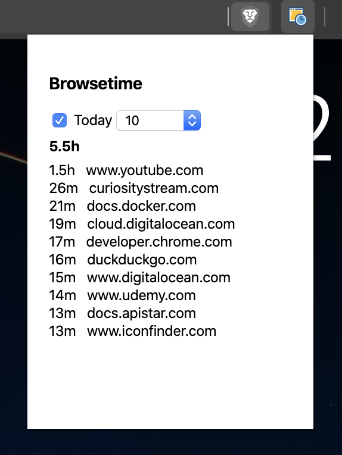

# Browsetime

A chrome/brave extension to monitor how much time you spend on websites.

## Install

1. Download the extension [here](-/archive/master/screentime-master.zip) and unzip it
2. Navigate to `chrome://extensions/` or `brave://extensions/`
3. Enable developer mode on the top right corner
4. Click on "Load unpacked" button on the top left corner, this should ask you to browse for the files.
5. Point to the extracted files from step 1

OR checkout the [releases](-/releases) to install from the crx file.

## Roadmap

- [ ] Display percentage change compared to yesterday, lastweek, month and it's previous time.
- [ ] Detect idle time better (Right now idle time is still tracked but chrome doesn't provide an api that does this properly as there doesn't seem to be a proper definition of "idle")
- [ ] Export the report to csv
- [ ] Charting and visualisations (low prio)

---

Inspired by https://medium.com/backticks-tildes/how-i-developed-apples-screen-time-chrome-extension-988e0c451894
